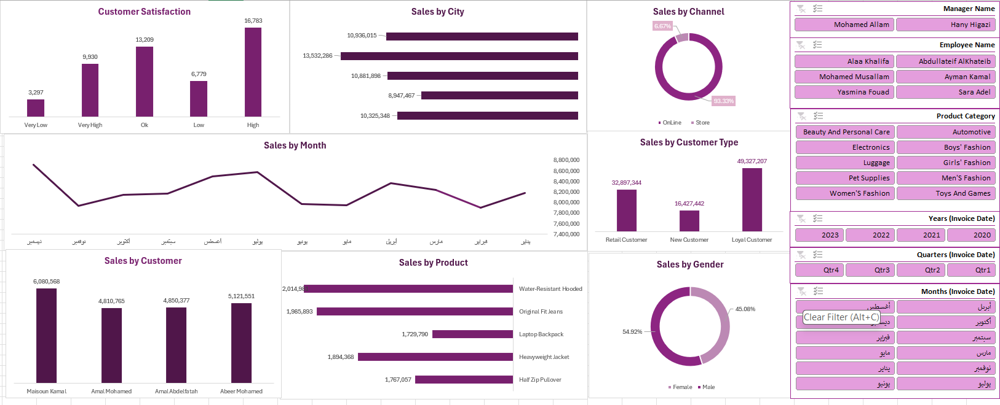

# Excel Sales Analysis Dashboard

An interactive sales analysis project built entirely in Microsoft Excel using PivotTables, slicers, and dynamic charts.

## Objective

Create an accessible Excel-based dashboard that allows users to explore sales performance without requiring a dedicated BI platform.

## Dashboard capabilities

- Analyze sales by city, month, channel, customer type, customer, product, and gender
- Filter by manager, employee, product category, year, quarter, and month
- Review customer satisfaction and sales patterns interactively
- Use slicers and PivotTables to move quickly between business views

## Tools and techniques

- Microsoft Excel
- PivotTables
- Slicers
- Dynamic charts
- Interactive dashboard design

## Files

- `Sales-Analysis-With-Excel.xlsx` — interactive workbook
- `dashboard_preview..png` — dashboard preview

## Related project

This Excel dashboard complements the Power BI version of the analysis: [Power BI Sales Analysis Dashboard](https://github.com/Raneem6/Power-BI-Sales-Analysis-Dashboard).

## Project note

The dataset is used for portfolio and learning purposes. The project demonstrates practical Excel analysis, reporting, and visualization skills.

## Author

Raneem Alzahrani · [LinkedIn](https://www.linkedin.com/in/raneem-alzhrani-/) · [Portfolio](https://sites.google.com/view/raneemalzahrany/home)